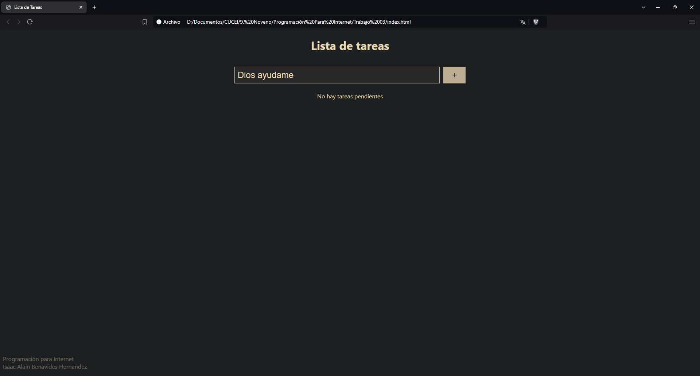
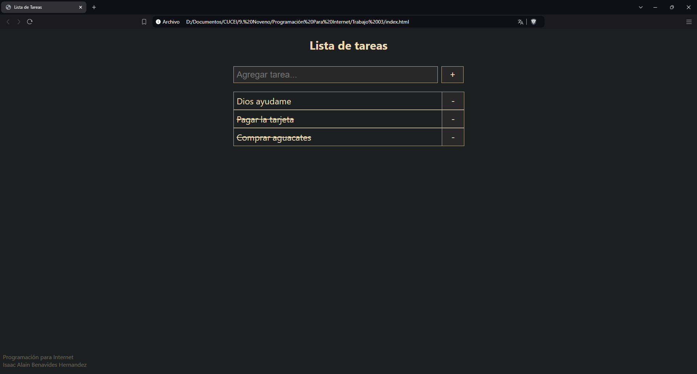
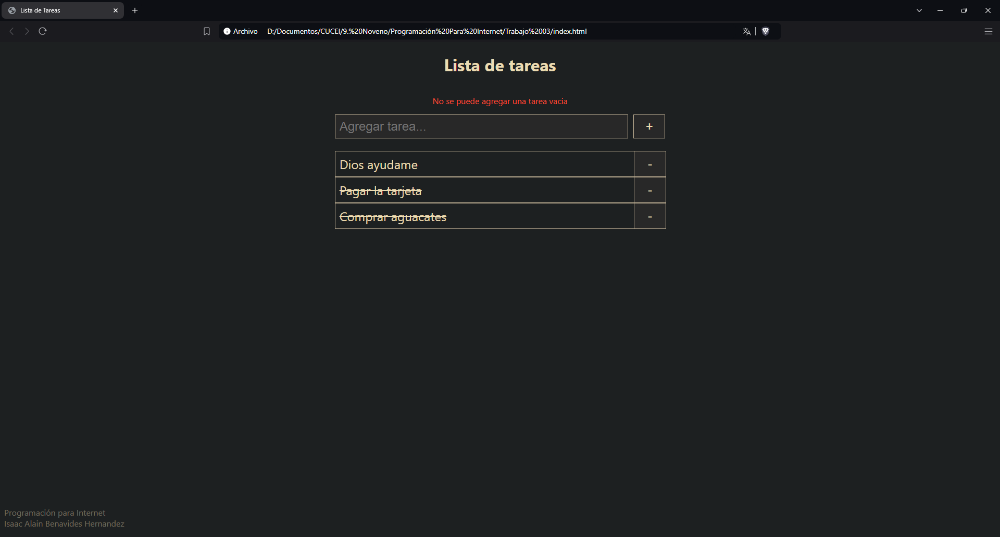
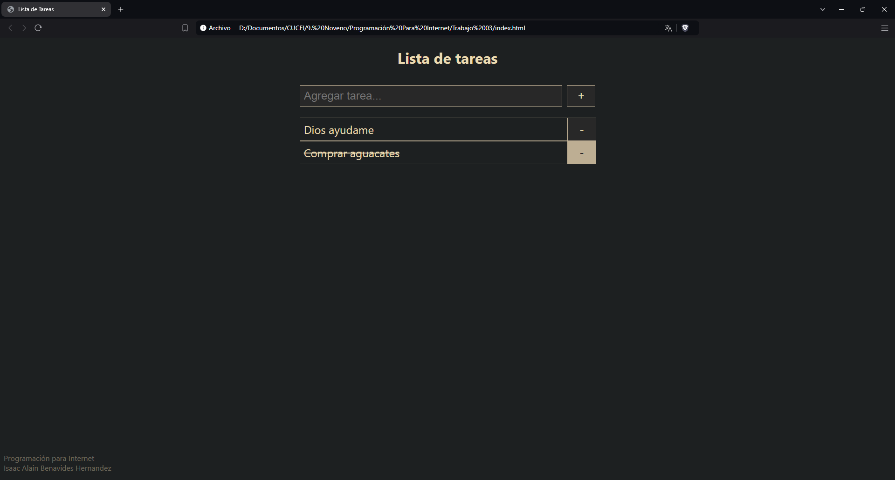
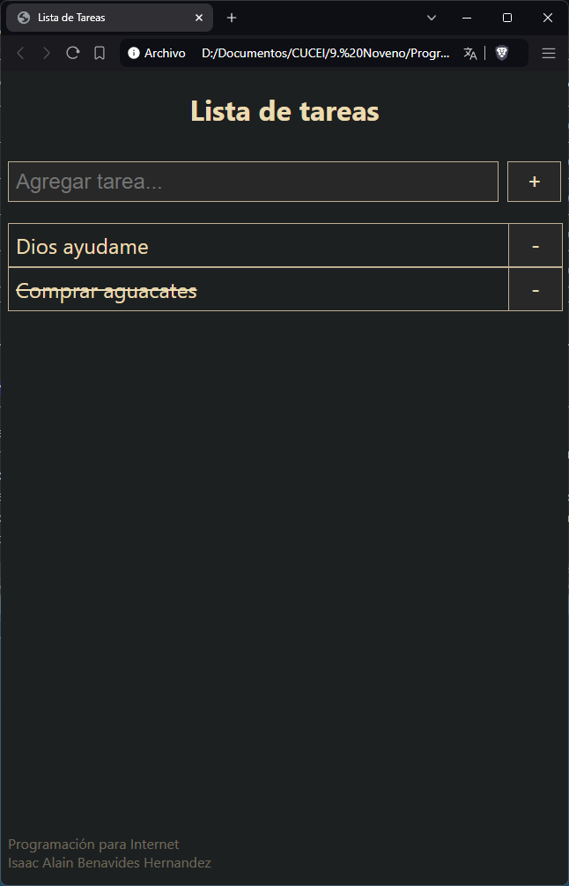

# Lista de Tareas
## Trabajo 03 - Programación para Internet

### Alumno
Isaac Alain Benavides Hernandez
216817953

Enlace a la página: 

#### Instrucciones
La lista de tareas esta desarrollada con JavaScript Vanilla, por lo que para ejecutar la app solo se tiene que abrir el archivo index.html en el navegador, o se puede abrir el enlace de arriba para probar el funcionamiento.

#### Funcionamiento
1. Se pueden agregar tareas nuevas escribiendo en el campo de texto y dando click en el botón "+".

Para marcar tareas como completadas se puede dar click en el texto de la tarea que ha sido agregada. Las tareas completadas se mostraran con el texto tachado.

Si se intenta agregar una tarea y no se ha ingresado nada en el campo te texto, se mostrará una advertencia arriba del campo de texto.

Si se quiere eliminar una tarea, se puede utilizar el botón "-" que esta al final de cada tarea.

Esta lista de tareas funciona con localStorage, por lo que si se cierra el navegador o se recarga la página no se borran las tareas guardadas previamente. Además de que se añadieron algunos estilos para que se adaptara a resoluciones más pequeñas que las de una computadora.

